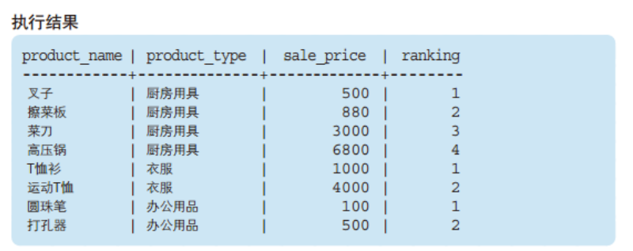
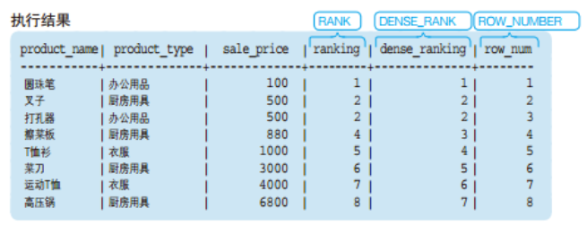
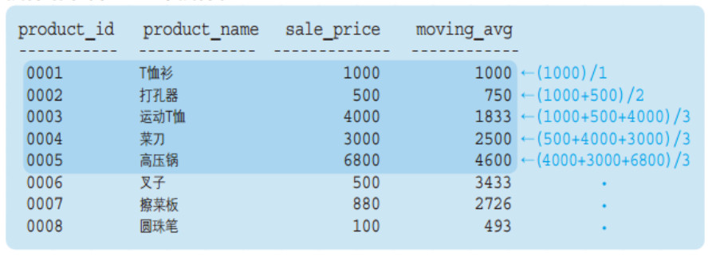
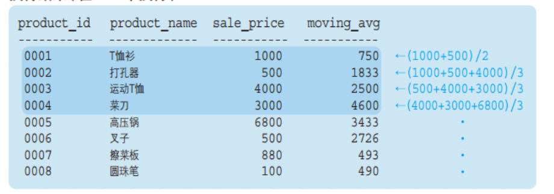
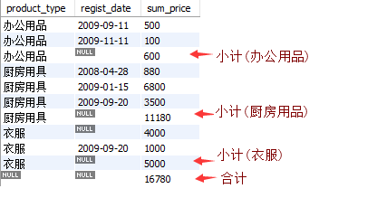
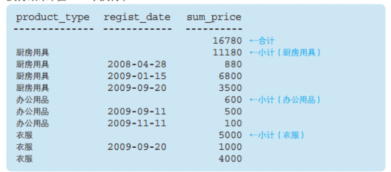

<div align=center>

</div>
<p align="center">MySQL | shenhao0223@163.sufe.edu.cn | 上海财经大学 </p>

- **Learner** : shenhao

# 5.1 窗口函数

## 5.1.1 窗口函数概念及基本的使用方法

窗口函数也称为**OLAP函数**。OLAP 是OnLine AnalyticalProcessing 的简称，意思是对数据库数据进行实时分析处理。

为了便于理解，称之为窗口函数。常规的SELECT语句都是对整张表进行查询，而窗口函数可以让我们有选择的去某一部分数据进行汇总、计算和排序。

窗口函数的通用形式：

```sql
<窗口函数> OVER ([PARTITION BY <列名>]
                     ORDER BY <排序用列名>)  
```
> **[]中的内容可以省略。**

窗口函数最关键的是搞明白关键字**PARTITON BY**和**ORDER BY**的作用。

**PARTITON BY**是用来分组，即选择要看哪个窗口，类似于GROUP BY 子句的分组功能，但是PARTITION BY 子句并不具备GROUP BY 子句的汇总功能，并不会改变原始表中记录的行数。

**ORDER BY**是用来排序，即决定窗口内，是按哪种规则(字段)来排序的。

举个栗子：

```sql
SELECT
	product_name,
	product_type,
	sale_price,
	RANK() OVER ( PARTITION BY product_type ORDER BY sale_price ) AS ranking 
FROM
	product
```

得到的结果是:




我们先忽略生成的新列 - [ranking]， 看下原始数据在PARTITION BY 和 ORDER BY 关键字的作用下发生了什么变化。

**PARTITION BY 能够设定窗口对象范围。** 本例中，为了按照商品种类进行排序，我们指定了product_type。即一个商品种类就是一个小的"窗口"。

ORDER BY 能够指定按照哪一列、何种顺序进行排序。为了按照销售单价的升序进行排列，我们指定了sale_price。此外，窗口函数中的ORDER BY与SELECT语句末尾的ORDER BY一样，可以通过关键字ASC/DESC来指定升序/降序。省略该关键字时会默认按照ASC，也就是

升序进行排序。本例中就省略了上述关键字 。


# 5.2 窗口函数种类

大致来说，窗口函数可以分为两类。

一是 将SUM、MAX、MIN等聚合函数用在窗口函数中

二是 RANK、DENSE_RANK等排序用的专用窗口函数

## 5.2.1 专用窗口函数

* **RANK函数**

计算排序时，如果存在相同位次的记录，则会跳过之后的位次。

例）有 3 条记录排在第 1 位时：1 位、1 位、1 位、4 位……

* **DENSE_RANK函数**

同样是计算排序，即使存在相同位次的记录，也不会跳过之后的位次。

例）有 3 条记录排在第 1 位时：1 位、1 位、1 位、2 位……

* **ROW_NUMBER函数**

赋予唯一的连续位次。

例）有 3 条记录排在第 1 位时：1 位、2 位、3 位、4 位

运行以下代码：

```sql
SELECT
	product_name,
	product_type,
	sale_price,
	RANK() OVER ( ORDER BY sale_price ) AS ranking,
	DENSE_RANK() OVER ( ORDER BY sale_price ) AS dense_ranking,
	ROW_NUMBER() OVER ( ORDER BY sale_price ) AS row_num 
FROM
	product
```





## 5.2.2 聚合函数在窗口函数上的使用

聚合函数在窗口函数中的使用方法和之前的专用窗口函数一样，只是出来的结果是一个**累计**的聚合函数值。

运行以下代码：

```sql
SELECT  product_id
       ,product_name
       ,sale_price
       ,SUM(sale_price) OVER (ORDER BY product_id) AS current_sum
       ,AVG(sale_price) OVER (ORDER BY product_id) AS current_avg  
  FROM product;  
```


可以看出，聚合函数结果是，按我们指定的排序，这里是product_id，**当前所在行及之前所有的行**的合计或均值。即累计到当前行的聚合。


# 5.3 窗口函数的的应用 - 计算移动平均

在上面提到，聚合函数在窗口函数使用时，计算的是累积到当前行的所有的数据的聚合。 实际上，还可以指定更加详细的**汇总范围**。该汇总范围成为**框架(frame)**。

语法

```sql
<窗口函数> OVER (ORDER BY <排序用列名>
                 ROWS n PRECEDING )  
                 
<窗口函数> OVER (ORDER BY <排序用列名>
                 ROWS BETWEEN n PRECEDING AND n FOLLOWING)
```
PRECEDING（“之前”）， 将框架指定为 “截止到之前 n 行”，加上自身行

FOLLOWING（“之后”）， 将框架指定为 “截止到之后 n 行”，加上自身行

BETWEEN 1 PRECEDING AND 1 FOLLOWING，将框架指定为 “之前1行” + “之后1行” + “自身”

执行以下代码：

```sql
SELECT
	product_id,
	product_name,
	sale_price,
	AVG( sale_price ) OVER ( ORDER BY product_id ROWS 2 PRECEDING ) AS moving_avg,
	AVG( sale_price ) OVER ( ORDER BY product_id ROWS BETWEEN 1 PRECEDING AND 1 FOLLOWING ) AS moving_avg 
FROM
	product;
```

**执行结果：**

注意观察框架的范围。

ROWS 2 PRECEDING：



ROWS BETWEEN 1 PRECEDING AND 1 FOLLOWING：



## 5.3.1 窗口函数适用范围和注意事项

* 原则上，窗口函数只能在SELECT子句中使用。
* 窗口函数 OVER 中的 ORDER BY 子句并不会影响最终结果的排序。其只是用来决定窗口函数按何种顺序计算。

**补充内容：**

OVER 子句中的 ORDER BY 只是用来决定窗口函数按照什么样的顺序进行计算的，对结果的排列顺序并没有影响。
因此也有可能像下图那样，**得到一个记录的排列顺序比较混乱的结果**。有些 DBMS 也可以按照窗口函数的 ORDER BY 子句所指定的顺序对结果进行排序，但那也仅仅是个例而已。


# 5.4 GROUPING运算符

## 5.4.1 ROLLUP - 计算合计及小计

常规的GROUP BY 只能得到每个分类的小计，有时候还需要计算分类的合计，可以用 ROLLUP关键字。

```sql
SELECT
	product_type,
	regist_date,
	SUM( sale_price ) AS sum_price
FROM
	product
GROUP BY
	product_type,
	regist_date WITH ROLLUP
```
得到的结果为：






这里ROLLUP 对product_type, regist_date两列进行合计汇总。结果实际上有三层聚合，如下图模块3是常规的 GROUP BY 的结果，需要注意的是衣服有个注册日期为空的，这是本来数据就存在日期为空的，不是对衣服类别的合计； 模块2和1是 ROLLUP 带来的合计，模块2是对产品种类的合计，模块1是对全部数据的总计。

ROLLUP 可以对多列进行汇总求小计和合计。


## 5.4.2 **GROUPING**函数——让**NULL**更加容易分辨

> Oracle、SQL Server、DB2、PostgreSQL的最新版本都已经支持这些本节所有的内容。
> 但是可惜的是MySQL 8.0 并不支持 CUBE 和 GROUPING SETS。希望之后的版本能够提供对它们的支持。
> **注：一下5.4的内容均在DB2中执行！**

可能有些读者会注意到，之前使用 ROLLUP 所得到的结果有些蹊跷，问题就出在“衣服”的分组之中，有两条记录的 regist_date 列为 NULL，但其原因却并不相同。

sum_price为4000日元的记录，因为商品表中运动 T 恤的注册日期为NULL，所以就把 NULL 作为聚合键了，这在之前的示例中我们也曾见到过。

相反，sum_price 为 5000 日元的记录，毫无疑问就是超级分组记录的 NULL 了（具体为 1000 日元 + 4000 日元 = 5000 日元）。但两者看上去都是“NULL”，实在是难以分辨。


为了避免混淆，SQL 提供了一个用来判断超级分组记录的 NULL 的特定函数 —— GROUPING 函数。该函数在其参数列的值为超级分组记录所产生的 NULL 时返回 1，其他情况返回 0。

```sql
SELECT GROUPING (product_type) AS product_type,
    GROUPING (regist_date) AS regist_date, SUM(sale_price) AS sum_price
FROM Product
GROUP BY ROLLUP (product_type, regist_date);
```


这样就能分辨超级分组记录中的 NULL 和原始数据本身的 NULL 了。使用 GROUPING 函数还能在超级分组记录的键值中插入字符串。也就是说，当 GROUPING 函数的返回值为 1 时，指定“合计”或者“小计”等字符串，其他情况返回通常的列的值。

```sql
SELECT CASE WHEN GROUPING(product_type) = 1 THEN '商品种类 合计' ELSE product_type END AS product_type,
CASE WHEN GROUPING(regist_date) = 1 THEN '登记日期 合计' ELSE CAST(regist_date AS VARCHAR(16)) END AS regist_date,
SUM(sale_price) AS sum_price
FROM Product
GROUP BY ROLLUP(product_type, regist_date);
```


在实际业务中需要获取包含合计或者小计的汇总结果（这种情况是最多的）时，就可以使用 ROLLUP 和 GROUPING 函数来实现了。

> **那为什么还要将 SELECT 子句中的 regist_date 列转换为 CAST（regist_date AS VARCHAR（16））形式的字符串呢？**
>
> 这是为了满足CASE 表达式所有分支的返回值必须一致的条件。如果不这样的话，那么各个分支会分别返回日期类型和字符串类型的值，执行时就会发生语法错误。

## 5.4.3 CUBE——用数据来搭积木

ROLLUP 之后我们来介绍另一个常用的 GROUPING 运算符 —— CUBE。CUBE 是“立方体”的意思，这个名字和 ROLLUP 一样，都能形象地说明函数的动作。那么究竟是什么样的动作呢？还是让我们通过一个列子来看一看吧。

CUBE 的语法和 ROLLUP 相同，只需要将 ROLLUP 替换为 CUBE 就可以了。

```sql
SELECT CASE WHEN GROUPING(product_type) = 1 THEN '商品种类 合计' ELSE product_type END AS product_type,
CASE WHEN GROUPING(regist_date) = 1 THEN '登记日期 合计' ELSE CAST(regist_date AS VARCHAR(16)) END AS regist_date,
SUM(sale_price) AS sum_price
FROM Product
GROUP BY CUBE(product_type, regist_date);
```


与 ROLLUP 的结果相比，CUBE 的结果中多出了几行记录。大家看一下应该就明白了，多出来的记录就是只把 regist_date 作为聚合键所得到的汇总结果。

① GROUP BY ()

② GROUP BY (product_type) 

③ GROUP BY (regist_date) ←添加的组合

④ GROUP BY (product_type, regist_date)

所谓 CUBE，就是将 GROUP BY 子句中聚合键的“所有可能的组合”的汇总结果集中到一个结果中。因此，组合的个数就是 $2^n$（*n* 是聚合键的个数）。本例中聚合键有 2 个，所以 $2^2$ = 4。如果再添加 1 个变为 3 个聚合键的话，就是 $2^3$ = 8。

读到这里，可能很多读者都会觉得奇怪，究竟 CUBE 运算符和立方体有什么关系呢？

众所周知，立方体由长、宽、高 3 个轴构成。对于 CUBE 来说，一个聚合键就相当于其中的一个轴，而结果就是将数据像积木那样堆积起来。


由于本例中只有商品种类（product_type）和登记日期（regist_date）2 个轴，所以我们看到的其实是一个正方形，请大家把它看作缺了 1 个轴的立方体。通过 CUBE 当然也可以指定 4 个以上的轴，但那已经属于 4 维空间的范畴了，是无法用图形来表示的。

## 5.4.4 GROUPING SETS——取得期望的积木

最后要介绍给大家的 GROUPING 运算符是 GROUPING SETS。该运算符可以用于从 ROLLUP 或者 CUBE 的结果中取出部分记录。

例如，之前的 CUBE 的结果就是根据聚合键的所有可能的组合计算而来的。如果希望从中选取出将“商品种类”和“登记日期”各自作为聚合键的结果，或者不想得到“合计记录和使用 2 个聚合键的记录”时，可以使用 GROUPING SETS。

```sql
SELECT CASE WHEN GROUPING(product_type) = 1 THEN '商品种类 合计' ELSE product_type END AS product_type,
CASE WHEN GROUPING(regist_date) = 1 THEN '登记日期 合计' ELSE CAST(regist_date AS VARCHAR(16)) END AS regist_date,
SUM(sale_price) AS sum_price
FROM Product
GROUP BY GROUPING SETS (product_type, regist_date);
```


上述结果中也没有全体的合计行（16780 日元）。与 ROLLUP 或者 CUBE 能够得到规定的结果相对，GROUPING SETS 用于从中取出个别条件对应的不固定的结果。然而，由于期望获得不固定结果的情况少之又少，因此与 ROLLUP 或者 CUBE 比起来，使用 GROUPING SETS 的机会也就很少了。

# 练习题

## **5.1**

请说出针对本章中使用的 product（商品）表执行如下 SELECT 语句所能得到的结果。

```sql
SELECT
	product_id,
	product_name,
	sale_price,
	MAX( sale_price ) OVER ( ORDER BY product_id ) AS Current_max_price 
FROM
	product
```


## **5.2**

继续使用product表，计算出按照登记日期（regist_date）升序进行排列的各日期的销售单价（sale_price）的总额。

排序是需要将登记日期为NULL 的“运动 T 恤”记录排在第 1 位（也就是将其看作比其他日期都早）

`Oracle中：可以在ORDER BY 后面指定某值的位置，如NULLS FIRST`

```sql
SELECT
	regist_date,
	sale_price,
	product_name,
	SUM( sale_price ) OVER ( ORDER BY regist_date ) as SUM
FROM
	product 
ORDER BY
	regist_date
```


## **5.3**

思考题

① 窗口函数不指定PARTITION BY的效果是什么？

不指定时，对排序列进行全列排序。

② 为什么说窗口函数只能在SELECT子句中使用？实际上，在ORDER BY 子句使用系统并不会报错。

是因为SQL语句的执行顺序，(FROM->WHERE->GROUP BY -> HAVING->SELECT->ORDER BY)，如果在WHERE、GROUP BY、HAVING子句中使用窗口函数，则会先进行一次排序，在执行WHERE、GROUP BY、HAVING各自的功能，会发出错误或失去窗口函数的使用意义。

